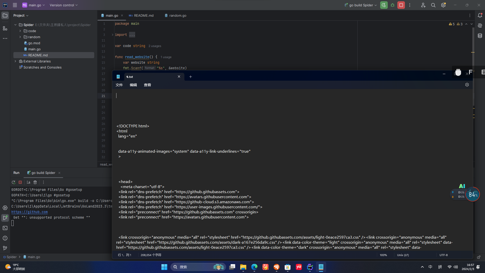

<h1 style="text-align:center">SpiderTemplateV1.0</h1>
<h2 style="text-align: center">Update "Save_code"</h2>

Now the code wil save in a ".html"

You can input a website's name.Then you will get a ".html" file in "code".The code is the website's code!

I use two days to make this project but I'm very happy now!

</img>

OK!

We need to open the file named "main.go" and run it.And then we input the website's name into the terminal.

Wait a moment.Then the website's code will in the folder "code",a ".txt" file will in it.The website's code will in it!

<strong style=color:yellow>Warring!</strong>
1,The file that the website's code in it has a random name.

2,Some times the SpiderTemplate can not connect web.It will be erro at that time.

3,We are students.And we used Golang first time in this project(we used Python before),Please give our some suggest!

4,Give me a star,please ! ! ! ! ! ! ! ! !

My website:<a href="https://wczzd.github.io">Wczzd</a>

(We also sell karambit(make of paper)!We make Happy too!!!)

—————————WczzdStudio